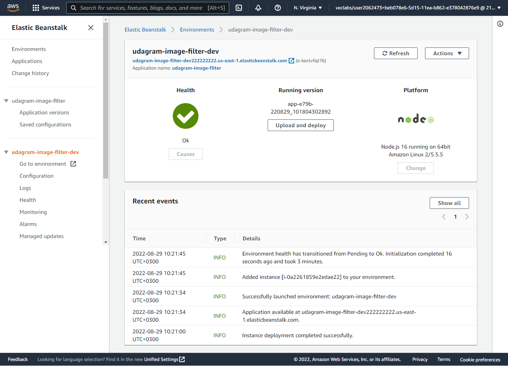

# Udagram Image Filtering Microservice

Udagram is a simple cloud application developed alongside the Udacity Cloud Engineering Nanodegree. It allows users to register and log into a web client, post photos to the feed, and process photos using an image filtering microservice.

## Github repo link
> [https://github.com/Roland-Sankara/udagram-image-filter](https://github.com/Roland-Sankara/udagram-image-filter)

## Elastic Beanstalk URL
> [http://udagram-image-filter-dev222222222.us-east-1.elasticbeanstalk.com/](http://udagram-image-filter-dev222222222.us-east-1.elasticbeanstalk.com/)

## Deployed your system status (screenshot)

